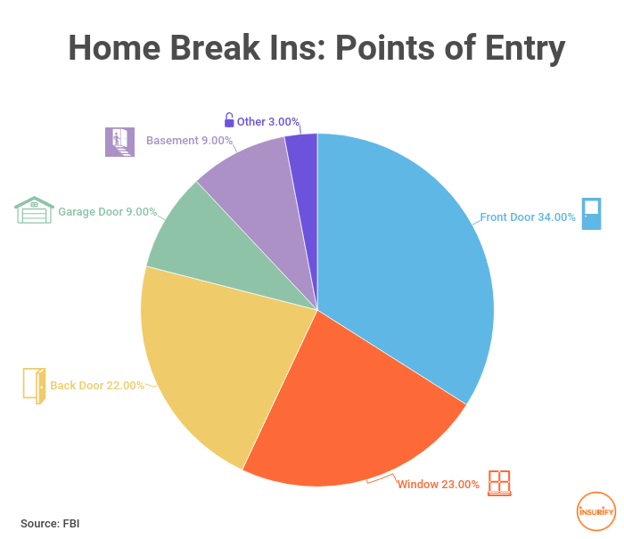
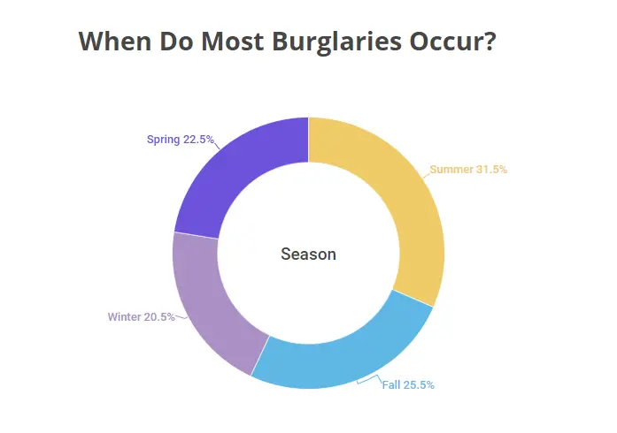

# Problem
Today security of interior spaces, in particular houses, is a relevant problem to address. Stats reveal that the 66% of burglaries (around 2.5 million each year) are home break-ins. 
More targeted buildings are apartments (70% of cases), especially the ones at the center of small and medium size towns. The most preferred time range seems to be surprisingly day time, with an increasing frequency during weekends. Access through front doors is slightly preferred, but windows and back door cover 45% of cases. On average, they last less than 10 minutes, so it is important to provide some guarantees in the design of a security system. Although it makes sense to focus on home security, it is easy to understand that a home security system can be easily adapted to other contexts, especially for the protection of generic buildings. 

  
This image shows which are the preferred points of entry for home break-ins. The most common point of entry is front door with the 34% of cases, followed by windows with 23% and at the same level back door with 22%. So, it makes sense so focus on a door prototype for my system as a starting point, since doors are sensitive targets. However, my system is already thought to be scaled to a distributed architecture, with more doors but also other types of nodes of interest such as windows.

As detected by CNA, in 2021 the number of reported home thefts in Italy was over 182 thousands, so almost 500 per day, more than 20 per hour, one every 3 minutes. However, there are few Italian families protecting their houses.  Only two out of three possess a security front door (65%), less than one third mounted door and window guards, the 30% of families is using security cameras and finally only approximately one third possess an alarm system (37%).

If considering the US, instead, according to the FBI statistics a burglar strikes every 30.48 seconds. That adds up to two burglaries every minute and over 3,000 burglaries per day. Break-ins and burglaries are the second most-mentioned property crime worry in the State of Safety Survey. Despite a high level of concern, only 38% of Americans declared to have a home security system to protect their property from burglary, so substantially the same percentage of Italy.

Even if it seems counter-intuitive, more burglars do their misdeeds in the bright light of day instead of under cover of darkness. A 2016 burglary victimization survey revealed that the most common time for burglaries was between noon and 4 p.m. FBI burglary data in 2021 showed that 196,684 of all reported residential burglaries occurred in the daytime compared to 154,723 at night.

When temperatures rise, so do the number of burglaries. On average, burglaries rise about 10% between June and August. More people were burglarized in June (regardless of the year) than in any other month, according to burglary surveys. June accounted for 11.3% of the burglaries experienced by respondents. March and April had the next-highest numbers of burglaries with 10.3% and 10.9%, respectively. Furthermore, rural states see more burglaries than those with big metropolitan hubs.

  
This image hence focuses on the distribution of burglaries during the year. The relevant fact is about a greater concentration of these events during the summer. For other seasons, instead, the number is substantialy the same, apart from a slightly greater percentage for fall. 

Another important challenge is to provide security to buildings in some contexts of isolation and lack of electrical power, or in case of energy cut. My system also moves in this direction, since it can be battery-powered. However, I assume that this is not the main mode of use, because in most use cases direct power supply is available.

# Proposed solution
My proposed solution consists of an authenticated web interface through which it is possible to monitor the state of fixtures of a designed building, ideally a house. The user is rapidly notified in case of break-in detection: it is possible to know the violated hotspot and the time of break-in. Obiouvsly all information must be provided according to determined time bound contraints. The movement of a door or a window is detected through an Hall effect sensor combined with a round magnet fixed to the mobile component (in my prototype, two magnets). The detection of door opening will trigger an alarm, which consists of an activated buzzer and a blinking LED, as well as the sending of a notification to the user. I also provide an activation/deactivation button, which must be placed in a protected location, in order to manually start or stop the alarm system. The system can also be activated or stopped remotely through the previously specified web-based dashboard.

# Use cases 
My system allows to do the following tasks:
* Manual activation and deactivation of alarm system through button
* Remote activation and deactivation of alarm system through web-based interaction
* Intrusion detection, with timestamp and location

# User requirements
* Detect door movement by using an Hall effect sensor and a magnet. Accuracy depends on the opening degree of the door, affecting the distance between the sensor and the magnet. The number of False Positives and False Negatives must be properly balanced by selecting an appropriate threshold, keeping into account that False Positives are preferred to False Negatives in this scenario.
* Events of interest are door openings, so movement changing the magnetic field through the presence of the magnet.
* Proximity of few millimeters in order to obtain a lower error rate.
* Prompt detection in at most in 2 seconds, considering the total duration of a burglary of less than 10 minutes.
* Alarm system by the use of a LED and a buzzer as actuators, that can generally be scaled to other bigger actuators.
* System working for 1 month by using a battery.

# Possible improvements
* LoRa integration on Heltec WiFi LoRa 32 v2
* Distributed architecture with multiple peer-to-peer MCUs
* Use of multiple sensors, such as motion sensors or cameras, for long range intrusion detection
* Strengthen website authentication security
* Data encryption, to avoid eavesdropping or DB leaks.
* Alternative notification systems, considering more user-friendly solutions such as the integration with messaging mobile applications.
