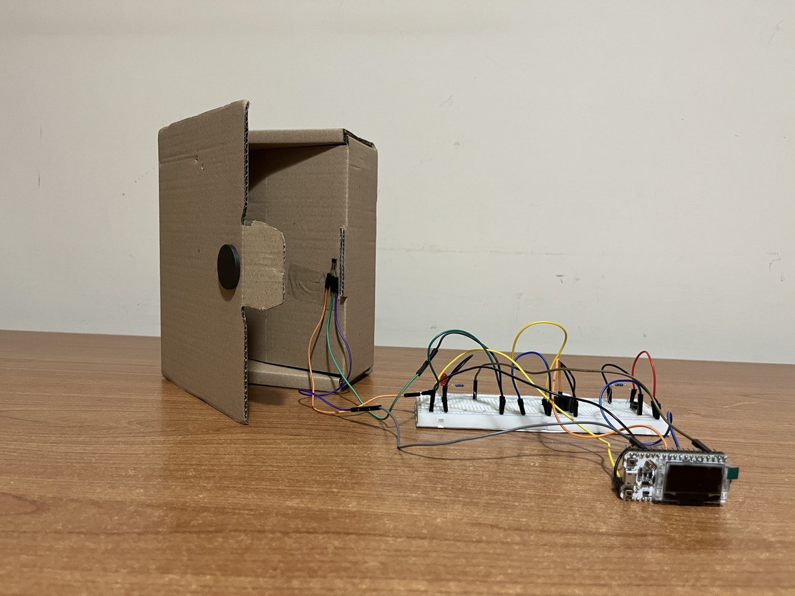
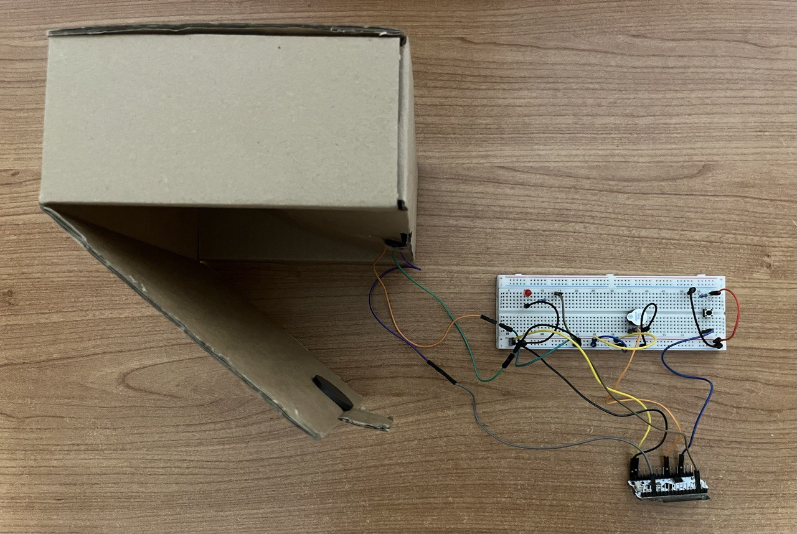
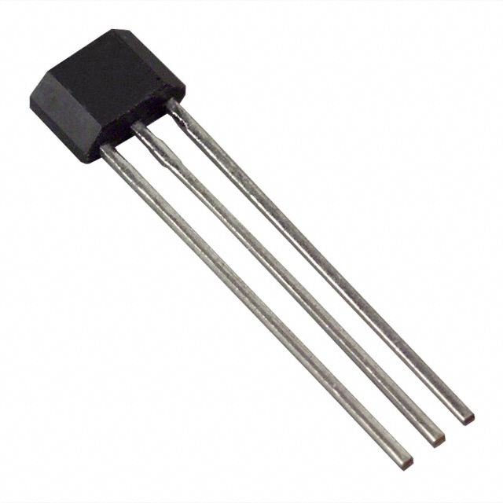
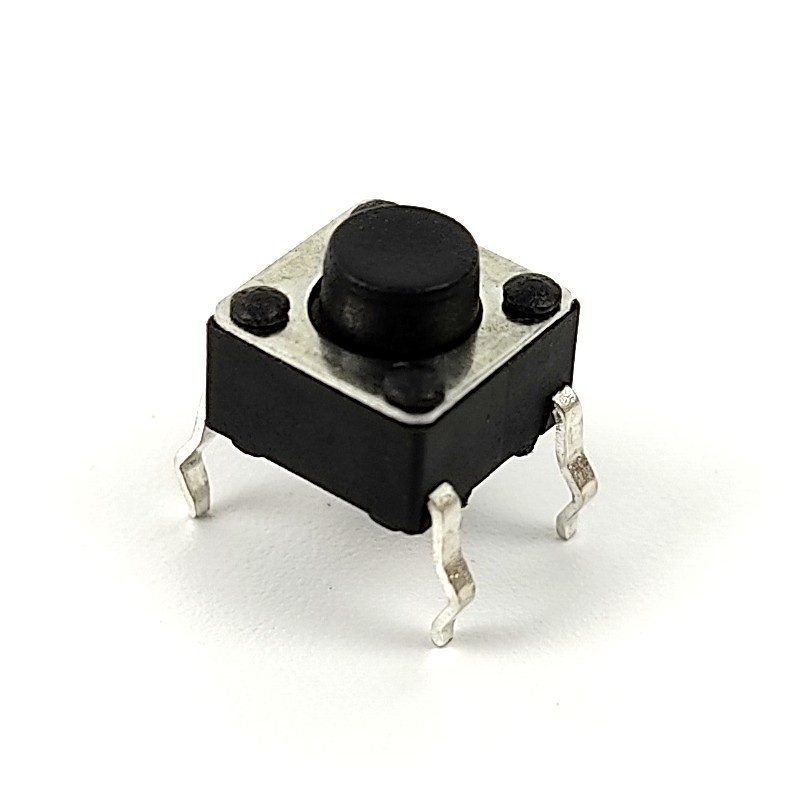
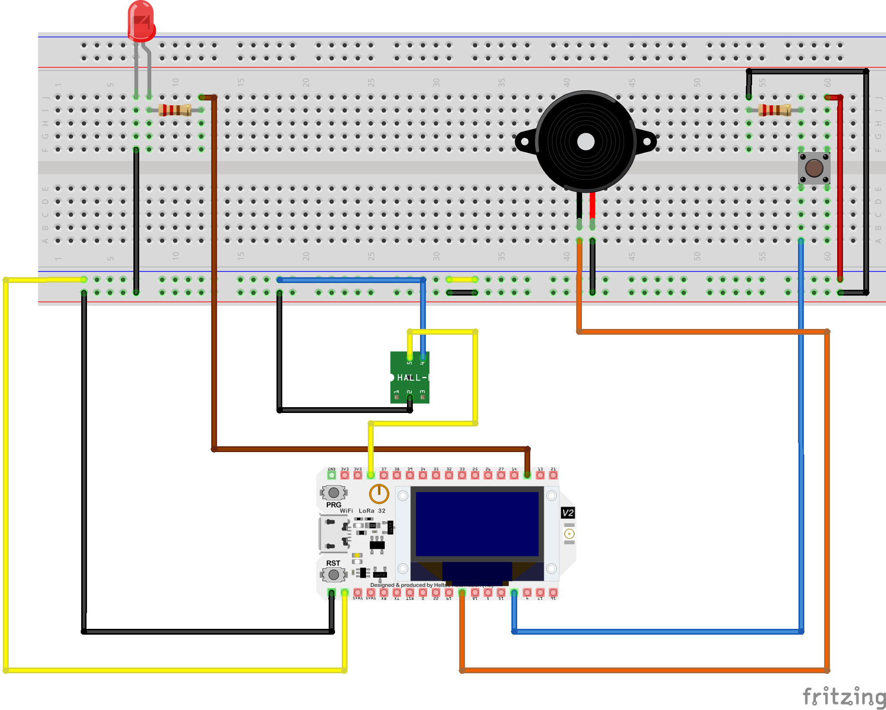
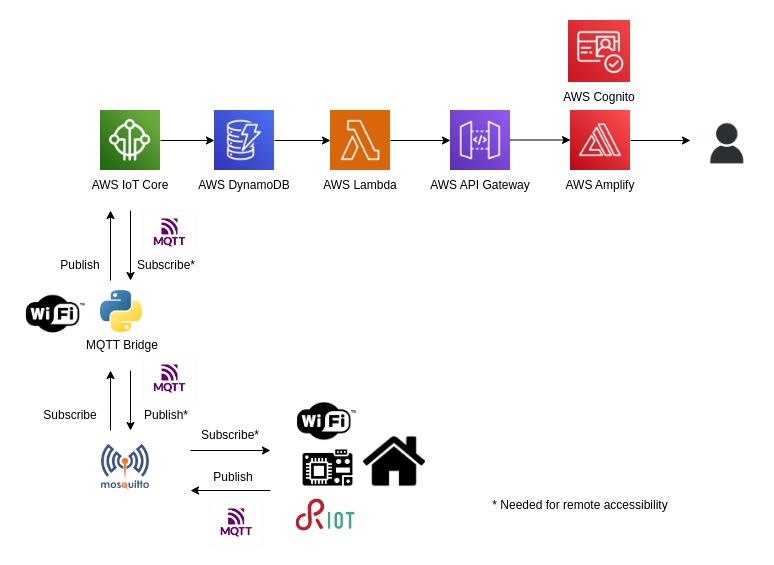
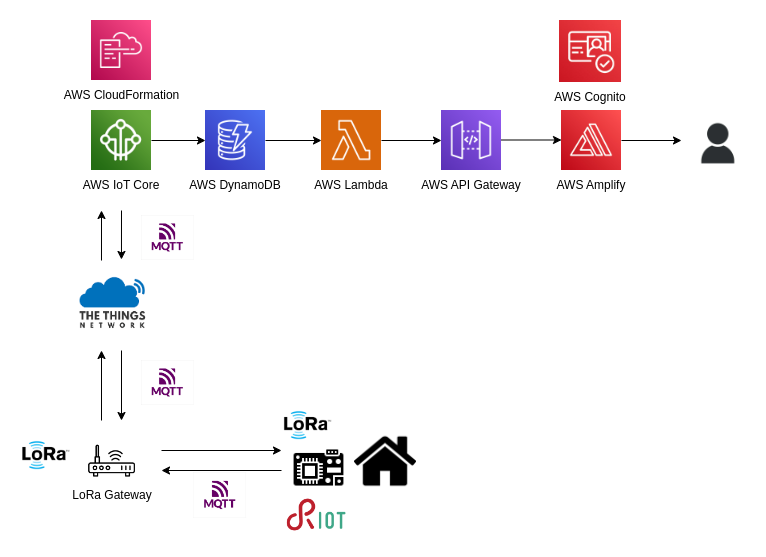
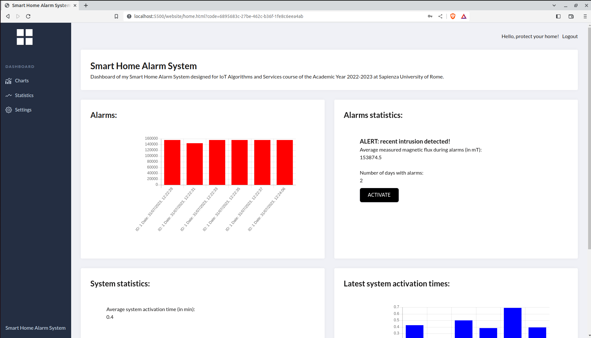

# Design

## Prototype

This is the prototype of my smart home alarm system. It simulates a single home hotspot, ideally the frontdoor, since it is the most critical access point to protect. The simple door prototype is realized with a cardboard box. The image shows how two magnets and a Hall effect sensor can be placed in order to detect door opening. The Hall effect sensor is placed on the static portion, fixed with tape, ideally in correspondence of the door frame. The magnets, instead, are placed on two opposite sides of the door. There are two reasons for the choice to use two magnets: not only it makes possible not to use any tape to keep magnets in their position, but also the generated magnetic field is higher and so the system is more effective, as it will be analysed later.
Magnets are initially placed near the Hall effect sensor, so the door is closed and intrusion must not be detected. However, in the starting condition, the alarm system is not activated, but it can be activated by pushing the physical button for few seconds (or through the web dashboard). After 5 seconds, useful to check that the door is properly closed, the alarm system is activated. When the door is opened, the alarm is triggered, so the led and the buzzer are periodically activated and deactivated. Obiouvsly, this will continue also if closing the door. If the button is pushed again (or, again, the system is deactivated through the web dashboard), the system will be deactivated and hence the alarm will be stopped.

  

In this image it is possible to better see the protoype infrastructure, in detail not only the components on the breadboard, but also the inner magnet and the placement of Hall effect sensor with the right alignment, in correspondence of magnets.

## Architecture idea
The core idea of my system is flexibility, both of context of use and of power availability. The system is thought to be mainly used with direct power supply, but able to adapt to constrained scenarios. This solution is undoubtedly feasible in most cases and certainly durable. The scalability of my system is related to the possibility to monitor an increasing number of hotspots and possibly multiple buildings.

In fact my architecture can be used to monitor the security of one or more houses (or, more generally, of buildings), typically composed of multiple hotspots (doors or windows), that can be violated by burglars. I assume the possibility to protect also a single hotspot, that can be an independent door that is not part of a building. The architecture is scalable and can be used to control the state of a point of interest, or different places simultaneously. For simplicity, I implemented the architecture focusing on a single door, simulated as a protoype. However, provided resources are very easy to scale up to more nodes.

## High level system idea
The designed ideal system differs from the real implemented one. The main differences are that my implementation involves a single MCU and not a distributed system, and also that used protocol is Wi-Fi instead of LoRa. It is due to some issues related to the functioning of RIOT-OS LoRa libraries with my chosen MCU. 
The final thought distributed system is made up of the following components:

* Hybrid-powered MCUs in correspondence of windows and doors. These MCUs are powered through a power chord by default, but they can also be battery-powered if needed.
* LoRa router, connected through a power cord, that connects the MCUs in the same area

## Components
My infrastructure is composed of:
* ESP32 MCU (Heltec WiFi LoRa 32 v2) with LoRa support for peer and cloud communication 
* 49E Hall effect sensor, used to detect door opening
* 2 round magnets, fixed to the two sides of the door
* Active buzzer, activated when a break-in is detected
* LED, activated when a break-in is detected
* Button, used to start and stop the alarm
* Cloud system (AWS) to collect and store data

### ESP32 MCU
  

This is my chosen MCU, the [Heltec WiFi LoRa 32 v2](https://heltec.org/project/wifi-lora-32/). The ESP32 manages the sensors and the actuators in the infrastructure and sends data to the cloud. The main technical issue is that the device will be attached to every object of interest and must implement an intensive duty cycle in order to be effective.
The MCU performs the sampling of the magnetic field in order to detect possible break-ins, using the 49E Hall effect sensor. If the alarm system has been activated, in case of detected door opening the MCU activates the alarm, using the LED and the buzzer.

### LoRa
  

LoRa is a physical radio communication protocol, based on spread spectrum modulation techniques derived from chirp spread spectrum (CSS) technology. The protocol is supported by my chosen ESP32 MCUs, allowing a low power and long range communication between microcontrollers in order to accomplish distributed tasks.
LoRa is a suitable protocol for the following reasons:
* It works with low power consumption, and this is a crucial added value to the protocol in case of battery-powered MCUs.
* It uses low bandwidth, and this is a great advantage in the chosen context. In fact, only simple data are exhchanged, namely door position measurements, so LoRa is certainly a good option.
* It can send data on long ranges. It is not an immediate advantage in my architecture, since nodes are ideally close to each other. However, it can be very useful firstly to reach also far LoRa gateways and on large scale systems to exchange data between distant nodes, if needed.

As specified before, the communication protocolo effectively used is Wi-Fi, which is much more energy-consuming. However, since the issue with RIOT-OS LoRa will be hopefully solved soon, I considered all the advantages of this protocol, also evaluating its choice, in order to only leave out simple code adaptation.

### Sensors
#### 49E Hall effect sensor
  

The SS49E is a linear Hall effect sensor. It can detect the presence and the strength of a magnetic field and it is immune to most environmental disturbances such as vibration, moisture, dirt or ambient lighting. In practice, the sensor can measure the presence of a magnet and even electrical current running through a conductor. It is possible to measure both north and south polarity of a magnetic field and the relative strength of the field. 

This is the sensor pinout. The output pin provides an analog output representing if a magnetic field is present, how strong a present field is, and if it is a north or south polar field. In my code, I refer to magnetic flux or magnetic field interchangeably.

If no magnetic field is present, the sensor will output a voltage around half of the source voltage. Instead, if the south pole of a magnet is placed near the sensor side labeled with text, then the output voltage will linearly increase towards the source voltage, proportionally to the strength of the applied magnetic field. Finally, if the north pole of a magnet is placed near the labeled side, then the output voltage will linearly decrease towards the ground voltage.

These are the specifications of the sensor:
* Supply Voltage: 3 to 6.5 V
* Max Output Current: 20 mA
* Quiescent Output Voltage: $\frac{1}{2}$ of $V_{cc}$
* Sensitivity: 2.5 mV/G
* Minimum Output Voltage: 0.86 V
* Max Output Voltage: 4.21 V

Dimensions (including pins):
* Length: 17.5 mm (0.69")
* Width: 4 mm (0.16")
* Thick: 1.52 mm (0.06")
* Weight: 0.11 g (0.004 oz)

I obtained the magnetic flux in mT by perfroming a proper conversion from the output voltage in mV. As specified before, since a user requirement is to detect an intusion in at most in 2 seconds, the magnetic field is measured every 2 seconds. In my scenario, measurements are not so variable, because they are either a low quite static value for closed door or an high quite static value for open door. I estimated the detection threshold by performing several experiment and by using different Hall sensors and a different number of magnets. In a distributed architecture, more considerations can be made. Firstly, it would be possible to estimate the threshold running a distributed algorithm, by simply measuring magnetic field with open or closed doors/windows. Furthermore, the advantages of computation on nodes and on the edge, which in my case is simply limited to intrusion detection, can be greater.

#### Button
  

A button is a simply sensor also called push button, tactile button or momentary switch. Push buttons allow us to power the circuit or make any particular connection only when we press the button. Simply, it makes the circuit connected when pressed and breaks when released. This basic component is placed indoor, used to activate and/or deactivate the alarm system. 
These are some specifications:
* Mode of Operation: tactile feedback
* Power Rating: max 50mA 24V DC
* Operating Force: 2.55 ± 0.69 N
* Contact Resistance: max 100 $m\Omega$
* Operating/Storage Temperature Range: -20 to +70 ℃

I used the push button as a switch, so in this case the measure of interst is binary, simply 0 or 1. When the button value is 0, the system is not active, while if pushing the button, the button value switches to 1 and the system is activated. The same reasoning holds for deactivation. Analysing the context of use and the application specifications, a good option is to check the value of the button every 3 seconds, in order to guarantee a great trade-off between computation load and usability.

### Actuators
#### Active buzzer
  

A buzzer is an audio signaling device, whose main function is to convert the signal from audio to sound. An electromagnetic buzzer is made with a magnet, solenoid coil, oscillator, housing, vibration diaphragm, and magnet. Once the power supply is given, the oscillator which produces the audio signal current will supply throughout the solenoid coil to generate a magnetic field. Sometimes, the vibration diaphragm will vibrate and generates sound under the magnet and solenoid coil interaction. The frequency range of this ranges from 2 kHz to 4kHz.

#### LED
  

I used a red light LED diode for signalling purposes. When an electric current passes through the LED, the electrons recombine with holes emitting light. This is achieved by allowing the current to flow in the forward direction and blocking it in the reverse direction.

### Cloud system
  

Data are stored on AWS for long term storage. In this way from logs it is also possible to obtain statistics about different break-in events. These data can then be queried by authorized users in order to gain insights about the state of fixtures of their monitored houses.

## Circuit
Here it follows a circuit scheme of the electronics in order to better understand the correct links and to be able to reproduce the system. Reported Hall effect sensor is different from used one, but the connections are the same.

  

## Network architecture 

### Wi-Fi architecture

This is the network design scheme using Wi-Fi communication and MQTT protocol. 

Data are generated from the prototype and sent to AWS, in detail to AWS IoT Core, through the MQTT Bridge running on a PC. Using two proper AWS IoT Core rules, called system_data_ddb and alarm_data_ddb, data are stored in two NoSQL Dynamo DB tables, SystemTable and AlarmTables respectively. With an AWS Lambda function called AlarmMonitorFunction, data are retrieved from DBs and made accessible through the deployment of an API with AWS API Gateway. So, a dashboard website deployed with AWS Amplify can take data dynamically from API endpoint in order to display information and statistics to the final user. The access to the website is authenticated using an AWS Cognito user pool with an associated application. Further details and a step-by-step explaination of the implementation are available on the [Hackster.io blog post](). 

### LoRa network
Since there weresome issues with the use of LoRa protocol with my chosen ESP32, I implemented the system using Wi-Fi communication, that is also supported but also more energy-consuming. However, since the design of the system has been thought to work with LoRa, I also report the general network scheme, for future adaptation. The main reference for integration is the following [official guide](https://aws.amazon.com/blogs/apn/connecting-your-lorawan-devices-from-the-things-stack-to-aws-iot-core/) from AWS.

This is the network design scheme using LoRa communication. 

Data are generated from the prototype and sent to AWS, in detail to AWS IoT Core, through a TTN (The Things Network) application, reached communicating with a LoRa gateway. In this case, also AWS CloudFormation is needed. So, as before, using two proper AWS IoT Core rules, called system_data_ddb and alarm_data_ddb, data are stored in two NoSQL Dynamo DB tables, SystemTable and AlarmTables respectively. With an AWS Lambda function called AlarmMonitorFunction, data are retrieved from DBs and made accessible through the deployment of an API with AWS API Gateway. So, a dashboard website deployed with AWS Amplify can take data dynamically from API endpoint in order to display information and statistics to the final user. The access to the website is authenticated using an AWS Cognito user pool with an associated application. So, obiouvsly, the main difference is the link with AWS IoT Core, but the remaining aspects of the infrastructure are left unchanged.

## Dashboard
Since the interaction with the application is very sensitive, especially with the introduction of remote activation/deactivation capabilities, it is extremely important to secure access to the web-based dashboard. For this reason, I provided the basic infrastructure for an authenticated website, with username and password to access the content. Here it is the sign-in page:

 There are a lot of security policies that can be adopted in order to secure the website, for example by limiting the number of users that can access the resource or by enforcing the security measures about cross-site requests and web authentication tokens. However, since it was not the main focus of the project, I simply instantiated a basic authentication sytem as a starting point for further improvements. After login, user can monitor home frontdoor by looking at last 6 alarm measurement displayed in the upper graph and checking some statistics about past alarms. A proper alert is shown in case of break-in. Furthermore, it is possible to see last system activation/deactivation events and to gain insights about last time sessions when the system was active.

However, after signing in as an authorized user (I used a single user and I assumed that it is authorized to access the content), it is possible to check the system state and to manage it.
Here it is a demonstration of the dashboard website content:

Apart from the remote activation button, last alarm measurements with relative timestamps are displayed, as well as some relevant statistics, that are the average magnetic field during alarm events and the number of days with triggered alarms. An alert displaying that an intrusion has been detected is displayed once.

Also for the system, the dashboard reports the timestamps of system activation and deactivation, with relative durations and average activation time of the system in minutes. Here it is the detail of the dashboard:

