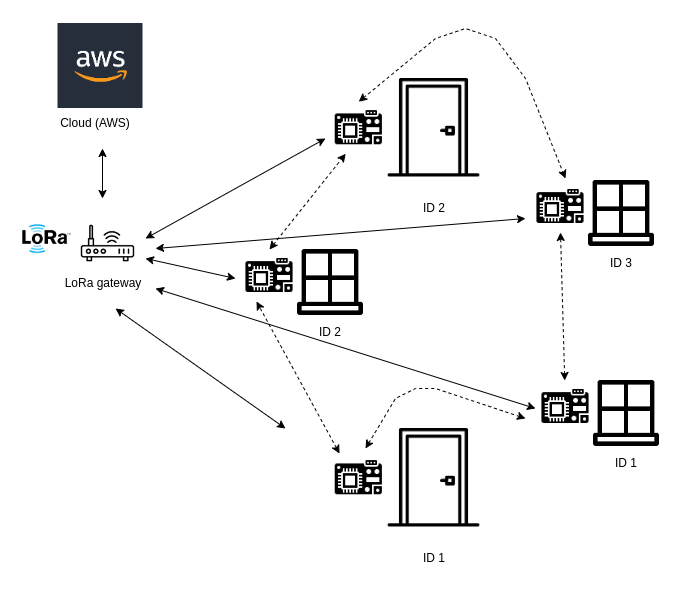

# Evaluation

## Preliminary considerations
### Problem data evaluation
From problem data, it is possible to understand which are the most sensitive hotspots to protect, defining a priority. So, it is needed to protect firstly front door (which is the ideal purpose of my prototype), since it is the most common target. Then, it is needed to protect windows and possible back doors. The best option is obiouvlsy to protect all possible access points to the building. 

Data suggests to be more cautious during summer, but for the system design it makes no sense to modulate the system behaviour according to the season, because there is the risk of designing a weak system. A break-in is an unpredictable event, so the system must be designed in order to guarantee that the intrusion is detected within a temporal upper bound. From user requirements, this upper bound is 2 seconds. 

### Current solutions

Here are some of the most common types of door and window sensors currently on the market:

* Contact sensors: they go off when the contact between the two parts of the alarm is broken. For these alarms, one contact is placed on the door or the window, and the other is set on a nearby piece of molding or wall. When the contacts touch, there is no sound, but when the contact breaks, an alarm goes off.
* Motion alarms: these alarms go off whenever motion is detected. Motion alarms work in a similar fashion to motion lights. When someone moves in front of the door or window, an alarm is triggered. Some alarm options have the motion sensor pointed toward the room of the house the alarm is connected to.
* Door and window sensors: these small alarms go off when the door or window they are attached to get moved. Door security sensors are designed to detect even slight movements and can be great for keeping intruders out. Most traditional home security systems come with a set number of door and window sensors.

Crucial features of home alarm systems are:
* Fast reaction
* Remote accessibility
* Embedded alarm 
* Notification system

My system provides all of these features. 

Some real security systems are:
* [Ring Alarm Contact Sensor](https://www.amazon.com/Ring-Alarm-Contact-Sensor/dp/B07ZB2QLC2), which integrates with the Ring Alarm Home Security system, which offers a range of smart home features. When the door or window sensor is triggered, you’ll receive a notification on your phone from the Ring app. 
However, it requires a specific proprietary system to operate and door sensor itself cannot sound an alarm. 
* [Noopel Magnetic Door and Window Alarms](https://www.amazon.com/Door-Window-Alarm-Noopel-Anti-Theft/dp/B07BVSMDNP), which can sound a loud 120 db alarm when triggered, and the alarm will go off whenever the contact sensor is broken. However, the biggest drawback is the absence of notification options.

* [Secrui Wireless Door Open Chime](https://www.amazon.com/Operating-Adjustable-Indicators-Receiver-Magnetic/dp/B07HSLB3BL), with a wide range of chime and volume options, but again with no notification options and not manageable remotely.

So, analysing some possible solutons from the market, in most cases current solutions are missing something. In some cases an embedded alarm is missing, in other cases no notification mechanism is provided or no remote accessibility. In my solution, instead, all listed desirable features of an alarm system are available.

### Analysis strategy
From given statistics it is possible to understand hat the phenomenon to monitor is not uniform, it depends on the season and on the time of the day. Furhermore, I kept into account the fact that a break-in can occur also when people are inside, so in that case it is more difficult to find the right trade-off between usability and security. To overcome, this problem, I decided to define the possibility to activate or deactivate the alarm according to user needs, so mainly when people leave the house, but not only in that case, in order to find a good compromise. The alarm can be activated or deactivated by using the push button and also remotely. I assume that the physical button linked to the alarm is placed in a physically safe location. An alternative is to properly protect the physical alarm activation and deactivation with a PIN by substituting the button with a numeric keypad like [this one](https://www.sparkfun.com/products/15290).

Even if there are periods of the year with higher probability of break-ins, it would not be secure to modulate the sampling according to this information, so the sampling is realized uniformly. So I analysed which is the best sampling rate to adopt in the chosen context. Since it is fundamental to have a fast response, I decided to choose a sampling rate of 2 seconds. In fact, it is not suitable to use a lower rate, because it would make the system unreliable, nor an higher rate due to performance reasons.

## Prototype evaluation

### Physical Alarm System Setting
Since diffent magnets can be used for the alarm system, I report some reference measures in order to know the correct equipment to use for a proper functioning of the system. In neutral conditions, the Hall effect sensor returns on average 3000 mV of output voltage 

Some experiments performed at a distance of 2 cm from the labeled side of Hall effect sensor reveal the linearity of the sensor. The measures are only indicative of the average computed value, because in reality there are some oscillations depending on small angle changes of the magnet. However, I tried as much as possible to test the sensor by getting closer the magnet/s with magnet surface parallel to labeled side. 

| Number of magnets | Min Output voltage | Max Output Voltage |
|--- |--- |--- |
| 1 | 2500 mV | 3200 mV |
| 2 | 2400 mV | 3300 mV |
| 3 | 2300 mV | 3400 mV |
| 4 | 2200 mV | 3500 mV |
| 5 | 2100 mV | 3600 mV |

Obiouvsly, higher and lower output voltages can be obtained by using a big magnet and by reducing the distance between the magnet and the sensor. By using 5 magnets and by decreasing the distance to 1 millimiter, the minimum obtained output voltage was 1295 mV, while the maximum one was 4095 mV. 

So, it is possible to notice that the difference from output voltage with no magnetic field and output voltage with the presence of a magnet increases with the strength of generated magnetic field. The best solution would be to use a small magnet generating an high magnetic field, in order to guarantee best performances and ease of installation. In fact smaller magnets are more practical to install.

In my case, I designed my system to work on the small door prototype, so a limitation was to use at most 2 magnets due to dimensional fitting. Since my simulated door is a cardboard box, I placed the 2 magnets at the two sides of the opening panel of the box, so that I did not needed to fix them with tape. Obiouvsly, I assume that in a real scenario magnets are safely placed inside the door structure, so that they cannot be removed.

So, in practice, my final configuration consists of 2 magnets placed at a distance of few millimiters from the Hall effect sensor. The north pole of magnets is placed near the labeled side of the sensor, so the output voltage is low when the door is closed. However, I tested the system in order to correctly work at a distance of 2 centimeters. In this way, I tried to avoid False Positives, in fact the reached output voltages with closed door are lower than tested one (value of the table for 2 magnets). Furthermore, considering protoype dimensions, when the magnets are placed at a distance of at most 2 centimeters from the Hall effect sensor, the opening angle is at most 5°, so it is not compatible with a break-in attempt. This motivates this type of strategy. Obiouvsly, the output voltage has to be simply converted to a proper magnetic field measure, in mT.

### Threshold setting
I tested the correct threshold to use in order to reveal the door movement. Since the north pole of magnets is placed near the labeled side of the sensor, when the door is closed the output voltage is decreased. As reported in the previous table, decreased value is at most 2400 mV, while it is around 3000 mV, when the door is open. So, since there are 600 mV of difference, the best option is to set the threshold at the half, so to 2700 mV. In this way, it is possible to limit both an high number of False Negatives, which are undesirable, and an high number of False Positives, which would make the system useless because unreliable. 

During my experiments, this relatively small difference range of output voltages has no impact on system functioning, because door opening is correctly revealed. However, a better option must be to make this range greater by using stronger magnets.

Hence a general strategy for threshold setting can be to firstly evaluate the range between sensor output voltage in presence of the magnet (placed in the final correct position) and output voltage with no magnetic field. A rule of thumb can be to set the threshold to the half of this range. So, it will depend on sensor calibration and on physical alarm system setting.

### Latency 
I decided to evaluate the latency only for the actual implemented system, so using Wi-Fi, because it was not possible to know the latency of LoRa protocol on my own physical MCU. In fact I thought it was interesting to analyse the latency of the real system, rather than a theoretical latency.

I evaluated the network latency for my prototype, which effectively uses Wi-Fi and MQTT. In detail, the latency from the MCU to the MQTT bridge is about 1 second, from the MQTT bridge to AWS IoT Core is about 2 seconds and from AWS IoT Core to the web-based dashboard is about 2 seconds as well. So, the total average network latency is about 5 seconds.

### Payload
Timestamp and device ID are automatically inserted in DBs from AWS IoT Core rules, while other information constitute device data and hence the actual sent payload.

The payload format for alarm messages (implemented in the protoype as a general solution) is:

{"alarm":"<0 or 1>","m_field":"<6 digits on average>"} 

with a size of around 32 bytes, possibly oscillating depending on the effective field value. In order to reduce the size, it is possible to use smaller fields name. By simply using "a" for "alarm" and "m" for "m_field", only 22 bytes are sent.

I left the field alarm to make the message more clear and for the insertion of future statistics in case of no alarm in the web-based dashboard. However, in the actual implemented system, it can be omitted, because messages are only sent in case of alarm, with the indication of revealed magnetic field, time and device id (added from AWS IoT rule). However, this design choice could generate confusion and it is not general.
So a possible reduction is to simply send the payload {"m_field": <6 digits on average>}, with 20 bytes. Again, by using "m" the size is reduced to 14 bytes.

The payload format for system messages is instead:

{"system":"<0 or 1>"}

because we simply need to know when the system has been activated or deactivated and from which device. The size is 14 bytes, that can be reduced to 9 bytes is using "s".

## Evaluation methodology: Overall System

General performance evaluation of the system:
I want to detect if a break-in occur within 2 seconds, in order to rapidly detect intrusions without tolerating more than 2 seconds of delay. I want also to know wich hotspot has been violated, notifying the user within 5 seconds.

I will use the following metrics to evaluate the performance of the system:

1. Break-in is dectected within 2 seconds.
2. The hotspot is correctly identified.
3. The notification is received from the user within 5 seconds.

## Evaluation methodology: Individual Components

I wish to evaluate the power consumption of the MCU, in detail when it is not attached to any power cord. There is an obvious trade-off between the duty cycle of MCU, impacting on the accuracy of the alarm system, and the duration of the battery. I assumed an operating time of one month, corresponding to the time that can be spent on a holiday home on average. A use case can be in fact a temporary installation of the system, or intended as an emergency power supply in case of main power source cut. So, for an MCU placed at a certain home hotspot, I wish to obtain a battery life equal to the total period of monitoring.

## Algorithms Performances

### System Activation Algorithm

For the activation of the system, it is needed to wait for physical or remote activation signal. So, the button pin is read every 3 seconds in order to check for a new activation signal. Also a subscription to local MQTT topic receiving data from web-based dashboard is performed. Due to the short timeout of the MQTT connection, a connection and a subscription is performed every 3 seconds as well.  When the signal is detected, a single activation message is sent on system MQTT topic.

+ Check button pin every 3 seconds.
+ Connect and subscribe to local MQTT topic receiving data from dashboard every 3 seconds.

The idea of system deactivation is substantially the same. Every 3 seconds the button pin is read and a subscription to local MQTT topic receiving data from dashboard is performed, in order to check for a new deactivation signal. When the signal is detected, a single deactivation message is sent on system MQTT topic. So, as before:

+ Check button pin every 3 seconds.
+ Connect and subscribe to local MQTT topic receiving data from dashboard every 3 seconds.

What about remote activation? Adding a remote functionality increases the risk of an hacking attack. The security of the alarm system will depend also on the security of the website. Instead, an easier solution is to define a single point of activation, so a physically protected button, or even better a numeric keypad. However, as considered before, remote activation is a key feature of this type of system, so I also implemented this possibility, that can be easiliy removed if not needed, also solving the problem of continuous MQTT subscriptions.

In fact, another crucial problem is related to power consumption. Since the MCU has to receive the remote activation signal, which is effectively  an unpredictable event, it must subscribe to a MQTT topic of local broker and be always in listen mode in order to receive the message. Even if MQTT is a low-power protocol, the continuous subscription can become highly energy demanding. However, if the MCU is attached to a power chord, it can be a feasible option. Conversely, if the user does not need this functionality, a more efficient solution only includes physical accessibility.

### Intrusion Detection Algorithm 
In order to detect intrusions, we have to check if the Hall sensor recognizes any movement. When it is active, the system samples (average of 10 measurements) the magnetic field in the proximity of the sensor, every 2 seconds. The final sample is published with alarm status on the alarm MQTT topic in case of alarm. It is also possible to send information in the stationary situation of closed door, in order to have a better feedback about the current state. However, the problem with this solution is that the DB could be rapidly filled if a message is sent every 2 seconds. In case of detected break-in, the alarm is started and the system starts to publish messages on alarm MQTT topic in order to trigger the alarm notification on website dashboard. If an alarm is started, it can only be stopped by pushing the button.

+ Sampling every 2 seconds
+ Publish data every 2 seconds in case of detected intrusion (with Wi-Fi or LoRa)

I will evaluate energy consumption based on the working principle of the system, also making relevant comparisons between different implementation alternatives.
The algorithms perfomance mainly depends on the capacity of the network, which is one of the bottleneck to consider.

## Energy Consumption
The MCU of my protoype can be thought as attached to a power chord, since it is possible to use the energy supply of the house. However, both for security (tolerance to accidental of intentional power cuts) and for portability, it is a good idea to use a battery energy supply. So, it is important to make some considerations about energy consumption in order to evaluate the needed capacity for batteries. The best option must be to use an hybrid solution, with direct power supply in normal conditions and a switch to battery energy supply in case of power cuts. However, this mechanism must be properly implemented by the use of a proper switching function triggered by the measurements of a power failure detector like [this](https://www.amazon.com/Power-Failure-Detector-Message-Alerts/dp/B089QQNKJL). 

In the following considerations, I started from system duration user requirement in case of no direct power supply. The worst case is the one of a portable system, thought for longer time periods than the power cut scenario. A reasonable assumption is a period of one month, that can be the time spent in an holiday home.

### Wi-Fi 
So, I started from the energy consumption evaluation in the case of Wi-Fi communication, that is my implemented solution, so easier to directly evaluate. The computation is related to the energy consumption of different system components:
* Hall effect sensor, I consider max output current: $5 V \cdot 20 mA = 0.1 W$
* Alarm system, so LED and buzzer: negligible contribution due to low probability of activation and low consumption. In fact, considering the application of the system, it is unlikely that the alarm will be activated more than some minutes in the time range of a month.
* Push button: negligible contribution, a simple switch of button pin is applied for activation and deactivation.
* ESP32 MCU in active mode: $5 V \cdot 180 mA = 0.9 W$
* ESP32 MCU in deep sleep mode: $5 V \cdot 800µA = 0.004 W$

In my analysis, I started from the consideration that there are mainly two energy consumption terms, one related to system activation or deactivation algorithm and one to intrusion detection algorithm, performed when the system is active. If the system is not active, the activation algorithm is executed, while if the system is active, both the deactivation algorithm and the intrusion detection algorithm (or alarm algorithm) are executed. Now, since activation and deactivation algorithms consume the same energy, the worst case is when the alarm system is always active, for all day.
In my implementation, the system is always subscribed to local MQTT topic receiving activation/deactivation signals from dashboard. However, since I consider remote management as an add-on, that can be removed without compromising system working, I do not consider this energy consumption contribution. 
A special term is the energy needed to read button pin every 3 seconds in order to check for alarm deactivation: 
    $$E_{button} = n_{BRead} \cdot P_{button} \cdot t_{BRead} $$

The MCU wakes up every 3 seconds to read button pin value, so it does $n_{BRead} = 28 800$ readings per day. On average, it takes $t_{BRead} = 350 µs = 0.35 ms$ to read button value. So, due to the very small time range, the lower number of repetitions and the simplicity of GPIO pin reading operation, this contribution can be omitted. 

In fact:
    $$E_{button} = 28 800 \cdot P_{button} \cdot (0.35 \cdot 10^{-3} s) \approx (9.7 \cdot 10^{-8} h)\cdot P_{button} Wh $$    

So, if considering these conditions, total daily energy contribution is given by:

$$E_{day} =  E_{Hall} + E_{button} + E_{alarm} + E_{active} + E_{deepSleep} \approx E_{Hall} + E_{active} + E_{deepSleep} $$
$$E_{day} \approx n_{Hsamp} \cdot P_{Hall} \cdot t_{Hsamp} + P_{active} \cdot t_{active} + P_{deepSleep} \cdot t_{deepSleep} $$

In this analysis, as specified before I am assuming the intrusion as a rare and short event, with a negligible energy contribution due to LED blinking and buzzer activation. Messages are sent to the cloud only at system activation and deactivation and every 2 seconds during an alarm event, which lasts only few minutes in our assumptions. So, messages sent to cloud are a negligible factor in this setting. Instead, if assuming the sending of one message for each magnetic field measurement (so alaso when no alarm is triggered), the contribution can no more be omitted. In fact in that case 43 200 messages are sent per day (one message every 2 seconds for the whole day).

In my context, the MCU always wakes up every 2 seconds and it does $n_{Hsamp} = 43200$ samplings per day. On average, it takes $t_{Hsamp} = 1500 µs = 1.5 ms$ to take mean measure. 
Hence daytime can be partitioned in $t_{active} = n_{Hsamp} \cdot t_{Hsamp} = 43200 \cdot (1.5 \cdot 10^{-3} s) = 64.8 s = 0.018 h$ in active mode and $(24 h) - (0.018 h) = 23.982 h$ in deep sleep mode. So, the MCU is only active around one minute per day.

Hence the computation will return in the worst case:

$$E_{day} = (0.1 W + 0.9 W) \cdot (0.018 h) + (0.004 W) \cdot (23.982 h) \approx 0.1139 Wh$$

So, every day the system requires 0.1135 Wh of energy. So, for a month:

$$E_{month} = 30 \cdot E_{day} = 30 \cdot (0.1139 Wh) = 3.417 Wh$$

It is interesting to see that this value indicates an highly demanding system. It is motivated by the specific application needs and also by the high power consumption of Wi-Fi.

From the [ESP32 Series](https://www.espressif.com/sites/default/files/documentation/esp32_datasheet_en.pdf) datasheet, a lower value for the Deep Sleep Mode is available:

$$P_{deepSleep} = 0.00075 W $$

So, it is possible to reduce energy consumption to:

$$E_{day} = (0.1 W + 0.9 W) \cdot (0.018 h) + (0.00075 W) \cdot (23.982 h) \approx 0.036 Wh$$

$$E_{month} = 30 \cdot E_{day} = 30 \cdot (0.036 Wh) = 1.08 Wh$$

However, since I want to refer to my own ESP32, I will consider the first obtained value, even if theoretically it is possible to do better.

So, the previous energy consumption analysis did not consider the contribution given by the periodical MQTT connect and subscribe to check for remote system activation and deactivation, performed every minute. That is because it is not a necessary functionality of the system and because it can make the system very energy consuming in the case of Wi-Fi. If this hypoteshis is taken into account in the computation of power consumption, as in the effectively implemented system, the energy contribution of this operation should be high, even if MQTT is a low-energy protocol, because MCU is using Wi-Fi communication.

However, again, I recall the previous considerations on system working principle. The periodical check for remote activation by listening on local MQTT broker makes sense only if the remote activation is a real need of the user. Obviously, if the user does not need this functionality, the system can be adapted and simplified by only using the button, with a better energy efficiency.

Furthermore, I assume that no messages for MQTT publish are sent in this case, because it is the stationary condition. It is important for the same reason as before, because sending messages with Wi-Fi can be highly energy consuming. As demonstrated in the following section, instead, with LoRa it is possible also to assume message publish without noticeable impact.

### LoRa
For this analysis, the energy consumption considerations remain substantially unchanged. The only difference is that in this case, with the ideal communication protocol solution, I assume that the MCU also sends messages to a LoRa gateway, instead of communicating with a local MQTT Broker with Wi-Fi.

I took LoRa energy consumption values from the Energy Monitoring module of a simulated IoT-Lab st-lrwan1 node. 

This image shows the listening process after firmware flash (peak). The higher level after the flash is the power consumption of listen, while the lower level is the power consumption of the MCU when it is in a low-power active mode: 

By analysing, the process, the average active power is:

$$P_{active} = 0.28 W$$

This image shows the energy consumption of the MCU when sending a message with LoRa protocol.
The transmission time and power are:
$$P_{trans} = 0.455 W$$ 
$$t_{trans} = (0.17 - 0.080) s = 0.090 s = 2.5 \cdot 10^{-5} h$$

The transmission effectively starts at 0.085 seconds, however, I considered all the interval time where variations are revealed. In this way I also considered the contribution of the energy for switching on and off the transmission.

For a more detailed analysis that keeps into account also messages sent to the cloud, let's make some realistic assumptions on system behavior in a time range of a month. We can assume a pair of activation and deactivation events per day, as well as 2 alarm events in a month, which are an overestimation. Each alarm lasts for 10 minutes, a reasonable time. Now, we count the number of sent messages in a month: 

* A message is sent at each activation/deactivation event, so 2 messages per day and $n_{system} = 60$ messages per month
* A message is sent each 2 seconds during an alarm event, so 30 messages per minute are sent, hence 300 for each alarm event. Since we assumed 2 alarm events, we have $n_{alarm} = 600$ messages. 

So, in total, each month:
$$n_{messages} = n_{system} + n_{alarm} = 60 + 600 = 660$$ 

messages are published.

$$E_{publish} = n_{messages} \cdot P_{trans} \cdot t_{trans} = 660 \cdot (0.455 W) \cdot (2.5 \cdot 10^{-5} h) = 7.5 \cdot 10^{-3} Wh$$

Since we want to be sure that the chosen battery will cover the whole energy demand, we make a further overestimation by adding the new energy contribution to the previous worst case energy computation, in stationary condition. In fact, in this new scenario, we are assuming activations/deactivations, hence time ranges without Hall effect sensor periodical sampling, that are instead included in $E_{Hall}$.
So, new monthly energy consumption is:

$$E_{day}^{LoRa} = E_{Hall} + E_{active} + E_{deepSleep} + E_{publish}$$
$$E_{day}^{LoRa} = (0.1 W + 0.28 W) \cdot (0.018 h) + (0.004 W) \cdot (23.982 h) + (7.5 \cdot 10^{-3} Wh) \approx 0.11 Wh$$

$$E_{month} = 30 \cdot E_{day} = 30 \cdot ( 0.11 Wh) = 3.3 Wh$$

I considered the previous $P_{deepSleep}$ value, so $0.004 W$. So, it is possible to see not only a decrease of the total power consumption, but also that the contribution of message publishing is almost negligible. In fact, the energy consumption is almost unaffected from the term related to the publishing of messages. If assuming the same messages in the case of Wi-Fi, instead, the contribution will not be negligible, and the power consumption will steadily increase. The same reasoning holds even strongly if assuming MQTT subscription. 

By using a battery of $1000 mAh$, we must assure that the MCU has a lifetime of more than one month, so it is possible to satisfy the user requirement.

Since the system is ideally powered through a cord, this energy analysis has been carried on for the case of no power supply due to accidental or accidental power cut, or also in case of a portable system.

### Possible improvements
#### Scalability
From the prototype, it is possible to scale up the architecture in order to design a distributed system, monitoring the security of different houses or isolated hotspots. Since the considered distances can become considerably higher, as well as the number of sent message, with the possibility of a peer-to-peer communication between nodes, LoRa protocol should be used.
Here it is the possible system architecture:

The working principle of the distributed solution is substantially the same, because each node detecting an intrusion will send the notification to the cloud. A new interesting feature, possible expansion of the system, is peer-to-peer communication, which makes possible to exhibit distributed intelligence. Some possible improvements are dynamic threshold estimation, load balancing and fastest response.

Analysing the implemented solution, the topics have been alreay designed to be scaled up. In fact, the general pattern is home/(category)/(device_id)/(type), where (category) indicates the category of the hotspot, so mainly doors or windows (but other categories are possible), (device_id) the identifier for the device and (type) one between alarm and system. In my implementation, there is only one node, with device ID 1, equipped with a button for activation/deactivation, so it is the only one publishing messages to the topic with system type. However, in a distributed architecture, multiple activating/deactivating nodes can exist. Alarms, instead, can be triggered from any node.

#### Website authentication
Since the information displayed on the website are sensitive, an hard challenge is the correct handling of users access, especially in a distributed scenario. I provided user authentication by simply setting up a basic AWS Cognito user pool, but some improvements can be applied in order to properly secure website access. A first measure is to properly protect user credentials, by storing and transmitting them in an encrypted way. It is considerably easier for an attacker to break the authentication mechanisms if user existence on the system is revealed. Other measures are robust brute-force protection and mandatory and strong multi-factor authentication, which has been set as optional in my implementation.

#### Securing physical devices
Another crucial aspect is the security of physical devices. Best option is probably to physically secure whole hardware set, because each component is necessary for the correct functioning of the system. By physically disconnecting LED, buzzer, Hall sensor or the button, some crucial functionality would be compromised and the system would be no more effctive.

### Conclusions
In conclusion, I want to recap the results of evaluation phase. By comparing my solution with currently available options on the market, it seems that it is not so easy to find a single solution integrating embedded alarm, notification system and remote accessibility. Furthermore, the vast majority of available solution are working with batteries, while my system is mainly designed to work with direct power supply. Its flexibility stands in the possibility of adaptation with the use of a battery if needed.

So I analysed latency, algorithms performance and energy consumption of the system, making some relevant considerations.
